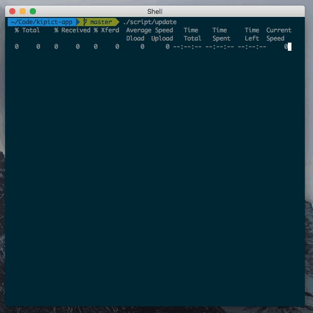

# Script Helpers

A helper file that can sourced into your project scripts to to DRY them
up.

If you don't know what project scripts are, please read
[scripts-to-rule-them-all](https://github.com/github/scripts-to-rule-them-all).

## Example

This is how it looks then a project script is executed:



This is the source file of the project script:

```bash
#!/usr/bin/env bash
cd "$(dirname $0)/.."
[ -f ".h" ] || curl -s -o ".h" -L https://git.io/v14Zc; . ".h"

RAILS_ENV=${RAILS_ENV:-development}

title "Checking system dependencies..."

ensure "which heroku" "brew install heroku-toolbelt"
ensure "which identify" "brew install imagemagick"
ensure "which phantomjs" "brew install phantomjs"

title "Setting up pow..."

ensure "which pow" "brew install pow"
ensure "test -d $HOME/.pow" "brew info pow"
ensure "echo 5000 > $HOME/.pow/kipict"

title "Setting up ruby..."

ensure "which ruby" "brew install rbenv"
ensure "which bundle" "gem install bundler"
ensure "cached Gemfile || bundle install"

title "Setting up postgres..."

ensure "which psql" "brew install postgresql"
ensure "echo '\\l' | psql postgres" "postgres -D /opt/boxen/homebrew/var/postgres"
ensure "echo '\\l' | psql postgres | grep kipict_$RAILS_ENV" \
  "heroku local:run rake db:create"
ensure "cached db/migrate || heroku local:run rake db:migrate"

title "Setting up redis..."

ensure "which redis-server" "brew install redis"
ensure "redis-cli ping | grep PONG" "redis-server /opt/boxen/homebrew/etc/redis.conf"
```

## Helpers

### `title`

Used to group several `ensure`s under the same concept:

```bash
title "Checking system dependencies..."
```

### `ensure`

Makes sure that a given command is successful and prints it's status
along with a short message on error.

```bash
ensure "which identify"
```

```bash
ensure "test -d $HOME/.pow" "brew info pow"
```

### `cached`

Caches the contents of a file or directory, returning whether the
existing cache was updated or not.

It should be used inside a `ensure` to avoid running time consuming
commands if the file or directory used to run that command hasn't
changed.

```bash
ensure "cached Gemfile || bundle install"
```

```bash
ensure "cached db/migrate || heroku local:run rake db:migrate"
```

## Installation

Include the following lines at the top of your script (make sure you're
using `bash` as the interpreter):

```bash
#!/usr/bin/env bash
cd "$(dirname $0)/.."
[ -f ".h" ] || curl -s -o ".h" -L https://git.io/v14Zc; . ".h"
```

Don't forget to add `.cache.*` and `.h` to your `.gitignore` file:

```bash
echo ".cache.*" >> .gitignore
echo ".h" >> .gitignore
```

## Update

If you want to update the helpers file, just remove the cached helpers:

```bash
rm -f path/to/project/.h
```
